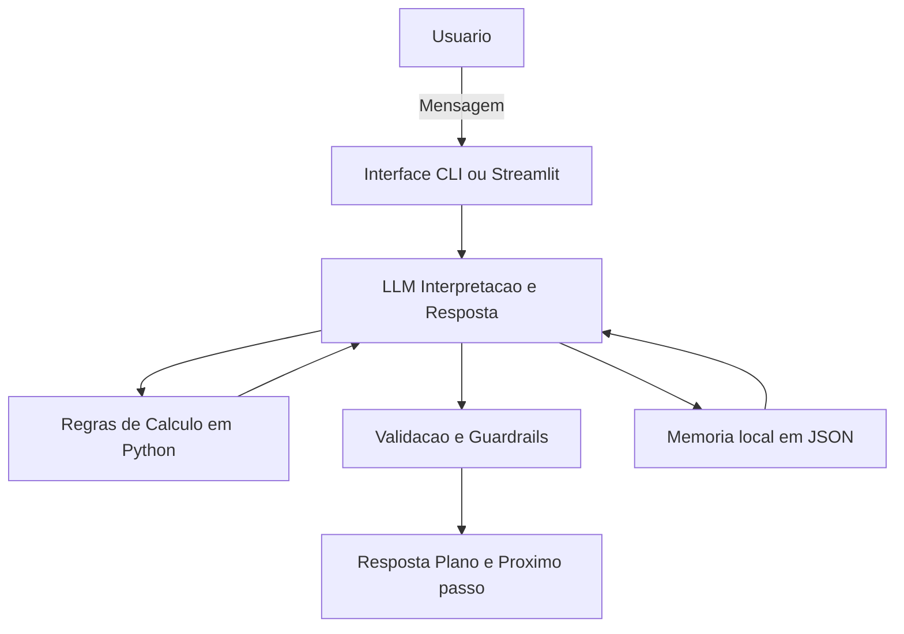

# Documentação do Agente

## Caso de Uso

### Problema
Muita gente sabe que precisa de **Reserva de Emergência**, mas não sabe:
- **quanto** juntar (meta)
- **como** juntar (plano mensal)
- **se está no caminho certo** (acompanhamento)

### Solução
O agente cria um **plano simples e proativo**:
1) Coleta contexto mínimo (gastos essenciais, renda e reserva atual)  
2) Define uma meta sugerida (ex.: **3 a 6 meses** de despesas essenciais)  
3) Calcula um plano de aporte (mensal/semanal) e um prazo estimado  
4) Acompanha progresso e faz ajustes quando o usuário atualiza dados  
5) Sempre mostra **“como calculei”** e sinaliza quando algo é estimativa

### Público-Alvo
- Pessoas começando a organizar finanças (CLT/autônomo)
- Quem não tem reserva ou tem reserva baixa
- Quem quer uma rotina simples de metas (sem planilhas complexas)

---

## Persona e Tom de Voz

### Nome do Agente
**ReservaCoach**

### Personalidade
Consultivo, prático e motivador (sem julgamento).  
Foca em passos pequenos e consistentes.

### Tom de Comunicação
Acessível e direto. Pouco “financês”.  
Usa exemplos e números arredondados quando fizer sentido.

### Exemplos de Linguagem
- Saudação: “Oi! Bora montar sua reserva de emergência em um plano simples?”
- Confirmação: “Fechado — com esses dados já dá pra calcular sua meta e um plano.”
- Erro/Limitação: “Ainda falta o valor dos seus gastos essenciais. Se quiser, posso estimar com base no que você informar por categoria.”

---

## Arquitetura

### Diagrama

### Componentes
| Componente           | Descrição                                                               |
| -------------------- | ----------------------------------------------------------------------- |
| Interface            | CLI simples ou Streamlit (chat + botões “Atualizar dados”)              |
| LLM                  | Modelo para linguagem natural (perguntas, explicações, resumo)          |
| Regras de Cálculo    | Funções Python para meta, aportes, prazo e progresso                    |
| Base de Conhecimento | `perfil.json` com dados do usuário (renda, essenciais, meta, progresso) |
| Validação            | Checagem de dados faltantes + respostas com cálculo visível             |

## Segurança e Anti-Alucinação

### Estratégias Adotadas

- [x] Só calcula com base nos dados fornecidos (ou marca como estimativa)
- [x] Sempre mostra o cálculo principal (meta, aporte, prazo)
- [x] Se faltar informação, pergunta ou oferece cenários (A/B/C) claramente
- [x] Não promete resultados e não “garante” economia
- [x] Não recomenda investimentos; foco é reserva com liquidez/segurança em termos gerais

### Limitações Declaradas

O agente NÃO:

- acessa conta bancária real ou extrato automaticamente
- substitui consultoria financeira/contábil
- indica “o melhor investimento” ou taxa/retorno garantidos
- toma decisões pelo usuário (apenas sugere e simula cenários)
